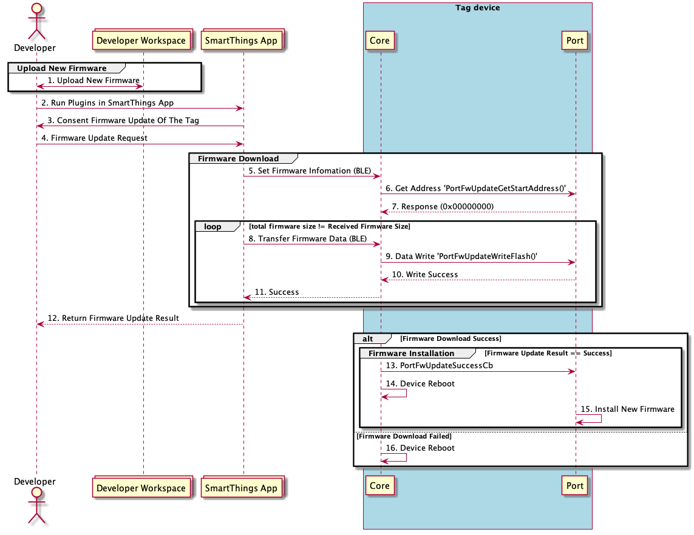
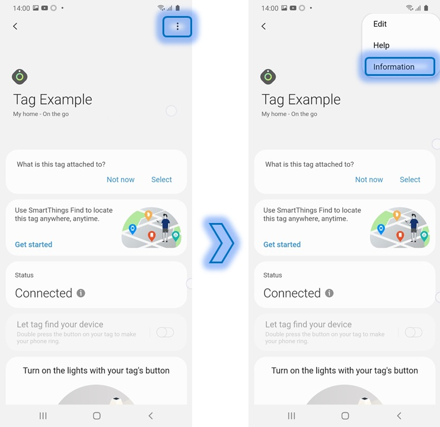
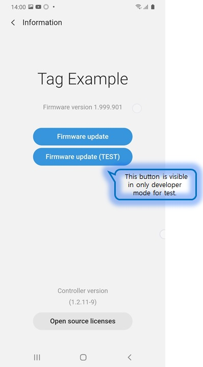

# Firmware Update Guide

This document is for supporting customers to easily add **firmware update** functionality when developing the Tag device with the *SmartThings Find Device SDK*.
In addition, you can learn how to download the firmware to the device through this document and how to install the downloaded firmware in the storage of the device.
And when using the firmware update function, firmware must be signed and the Tag device must be implemented to verify the signature.
Firmware signing may use methods provided by each chipset vendors (Each chipset vendors may have their own firmware signing logic) or
logic to check firmware signing at the Tag Core level provided by the *SmartThings Find Device SDK*.
However, some chipset vendors require their own firmware signing logic. Therefore, you have to consider this part and select it.


This document contains
* [Firmware Update Basic Operation](./Firmware_update_guide.md#1-Firmware-update-Basic-Operation)
* [Firmware Update Function Development Method](./Firmware_update_guide.md#2-Firmware-Update-Function-Development-Method)
* [Firmware Update Test Method](./Firmware_update_guide.md#3-Firmware-Update-Test-Method)
* [Security](./Firmware_update_guide.md#4-Security)


## 1. Firmware Update Basic Operation

This is the basic operation flow for firmware update. Firmware update function can be operated after device registration through SmartThings app. The firmware update consists of downloading the firmware to a specific area of the storage and installing the firmware after downloading.

The first download step provides download functionality in the *SmartThings Find Device SDK*. And the function to store in the actual storage should be developed through the Port function implementation.

The second firmware installation process depends on the chipset. Therefore, it should be implemented directly according to each chipset vendors.


## 2. Firmware Update Function Development Method




### 1) Developing Firmware Download

The function that downloads firmware to the Tag device includes a protocol that downloads firmware by interoperating
with the SmartThings app in the Tag core block of the *SmartThings Find Device SDK*.
You should implement 'feature to set start address to write firmware in storage' and 'feature to write firmware in storage' in the Porting Layer.
Then the firmware download function will be completed.

`./TagSDK/port/XX/PortFwUpdate.c`

```c
uint32_t PortFwUpdateGetStartAddress()
{
    /* please add code here */
}

TagError_t PortFwUpdateWriteFlash(uint32_t length, uint32_t Addr, uint8_t *pData)
{
    /* please add code here */
}

void PortFwUpdateSuccessCb(void *param)
{
    /* please add code here */
}
```

### 2) Developing Firmware signed

The firmware can be installed from the bootloader included in the chipset's BSP. if not, please request information of firmware installation to chipset vendor.

- [Atmosic SDK](./How_to_create_firmware_for_atm33.md) 
- [Nordic nRF5 SDK](./How_to_create_firmware_for_nRF52_dk.md) 
- [Nordic nRF Connect SDK](./How_to_create_firmware_for_nRF52840_ncs.md) 

## 3. Testing Firmware Update with SmartThings App

If you prepare all the things in document, you can run firmware update function in SmartThings app.

(1) Upload New firmware image through Developer Workspace

- [How to request firmware update](../../../../TechSupport/wiki/How-to-request-firmware-update)


(2) On-board demo device with SmartThings app

(3) Select device card from SmartThings app

(4) Select 'more > Information' then you can find _Firmware update_ button enabled



(5) Press _Firmware update_ button


