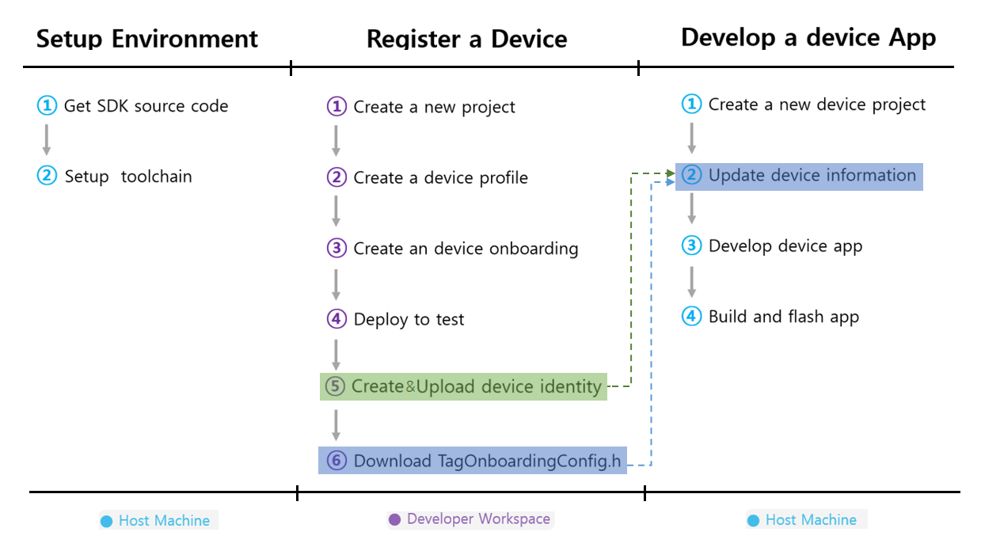

# Getting Started

SmartThings Find Device SDK is SDK for developing device working with SmartThings Find Service. It's already ported on many BLE solutions and you can port new chipset with same porting interface. It's also tested and validated with SmartThings app. So with given examples, you can make a simple tag device right away. Of course you can customize it for your own product with several configuration and guides. 

## 1. How to build and develop examples

This chapter guides steps you can easily follow to make one simple tag device. You can start your first tag application from one of examples we prepare. Here is simple develop flow. With blue color jobs, you can work on your PC and with purple ones, on [SmartThings Developer Workspace](https://developer.smartthings.com/).

#### 1) Setup Environment 

First, you should download SDK. We prepared below examples for your test. Choose right one with your chipset.

* [Atmosic chipset](./develop_atmosic_device_app.md)
* [Nordic chipset](./develop_nordic_device_app.md)

And If you want to add a new chipset in the SDK, you need to implement Port layer follow the below guide.

* [How to add new chipset](./How_to_add_new_chipset.md)

#### 2) Register a device

Second, you should create a device identity. And then create a new project and register new device in Developer Workspace to work with SmartThings app.
You can learn from below link. When you successfully follow the document, you can get a `TagDeviceInfo.h` and a `TagOnboardingConfig.h` for your device. Please keep them another place for future use.

* [How to register device](../../../../TechSupport/wiki/How-to-register-device)

#### 3) Develop a device app

Finaly, let's build and test examples.

## 2. How to test tag device with SmartThings app

#### 1) Enable **Developer Mode**
You must enable **Developer Mode** to test your device. This option is hidden by default. You can learn from below link.
* [How to set developer mode in the SmartThings app](../../../../TechSupport/wiki/How-to-set-developer-mode-in-the-SmartThings-app)

#### 2) On-board test device
And then, you need to restart SmartThings app and power on the test device. Once developer mode is enabled, you can see my testing devices menu in the parter devices. After clicking it, you can start onboarding process.(Remember test device will go to deep sleep mode(no BLE advertising) after 5 minutes with specific sound. To wake the device, you need to click button.)

#### 3) After onboarding, you can see device status and several device information on device plugin.
