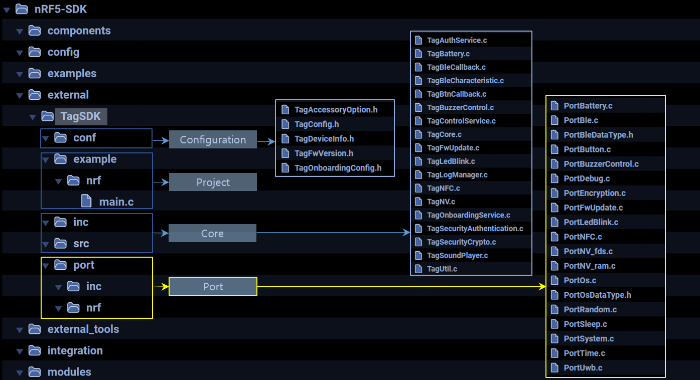
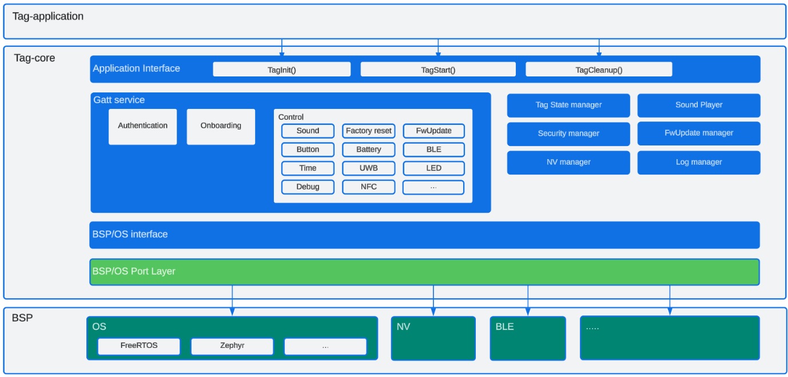
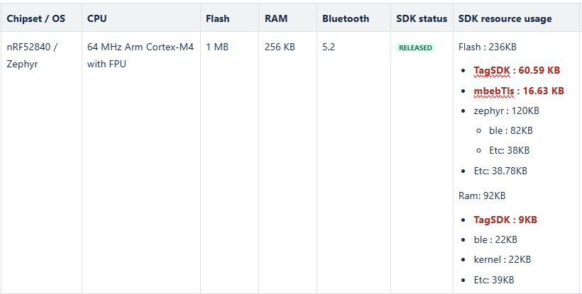
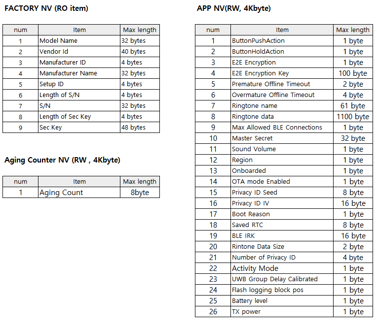
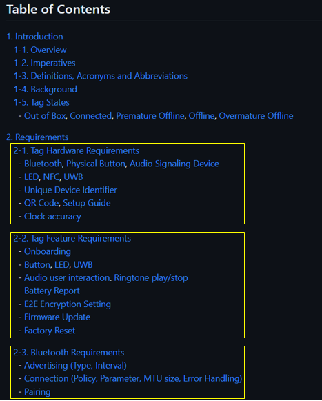

# How to add new chipset with SmartThings Find Device SDK

This document helps you develop your own product working with SmartThings. With this SDK, your product can be linked to Galaxy Find Network and searched through the broad network area. In addition that, it can be integrated in SmartThings platform and utilize various IoT resources.

This SDK is pre-made application working with SmartThings Find Service. So most things your application does to enable the services are initializing and starting. As long as porting part is well provided, you are enough to go with above functions. But if unfortunately, you need to implement porting part too

This SDK is using some resources exclusively like BLE or physical button etc. So your application need to be careful accessing those resources. Or if you want share those resources, you need deep understanding how it works and modify the porting part.

And now here are some key topics you should know before making your own product. Please check each one and get some useful information for developing.

- [Directory layout](#Directory-layout)
- [SDK block diagram](#SDK-block-diagram)
- [Requirements Analysis](#requirement-analysis)
  - [S/W Check List](#1-sw-check-list)
  - [Device Specification](#2-device-specification)
- [Implementation (Coding)](#Implementing-coding)
  - [Project](#1-project)
  - [Core](#2-core)
  - [Port](#3-port)
- [Testing](#Testing)
- [Customization](#Customization)

## Directory layout
The SmartThings Find Device SDK consists of two parts - Core and Port. The core contains most of the tag operations and is already implemented. However, the port needs to be customized for each solution and may not be implemented for certain solutions.
This document provides guidance for porting the SDK to a new chipset that is currently unsupported.

| Layout | Description |
|--------|-------------|
| Configuration | The configuration files which contains device and/or project specific information.  - TagAccessoryOption.h which defines feature set of device   - TagConfig.h which defines feature set of this SDK   - TagFwVersion.h which contains firmware version information   - TagDeviceInfo.h which contains device's identity information `Test Device Only`   - TagOnboardingConfig.h which contains project specific information |
| Project | Application example source code based on the SDK provided by Chipset Provider (ex: nordic, atmsoic, etc).|
| Core | SmartThings Find Device SDK core logic including tag state manager, NV manager, log manager, firmware update manager and sound player |
| Port | Implementation of BSP to support Core's operation. Some Port functions are dependent on BSP, but some Port functions are dependent on products. In this case, it is necessary to implement it according to the product. |

## SDK block diagram

You can check overall SDK architecture with above diagram.

Currently it exposes three APIs for tag-application. They mainly initialize and start functions of SDK. For the detail, please refer [SDK APIs section](#adding-sdk-apis-in-own-tag-application).
And Core contains SmartThings Find Device Core operations. It mainly manages GATT server and read/write operations for each BLE characteristics. Also it manages state diagram, firmware managing and sound player for device behaviors.
Port is porting code area for each solution. Mostly they might be provided for your product solution. Though to make commercial product, you might need some customization and modification. For the detail, please refer [customization section](#Customization).

## Requirement Analysis

### 1. S/W Check List

| Group | Check item | Samsung Feedback |
| --- | --- | --- |
| Software Development Model | Preferred IDE / build environment? | Visual Studio Code |
| Firmware Update | Tag FW update via BLE? | yes (refer : [Firmware update guide](./Firmware_update_guide.md)) |
| | UWB FW update via BLE? | yes (Optional : Partner need to implement code in 'PortUWB.c' file) |
| | firmware signing? | yes (The device must be able to update it's firmware with using validation of integrity and authenticity of signed updates.)|
| OS | Preferred OS? | Zephyr   FreeRTOS |
| bootloader | Preferred bootloader | MCUboot |
| BLE features | Peripheral only? | yes |
| | No observer (scanner) role? | yes |
| Platform driver support | SPI/PWM etc.? | SPI (External Flash): SPI   PWM (Buzzer control): enable, PWM |
| | GPIO mapping | GPIO: Button |
| | NFC | yes |
| | LED | yes |
| | UWB | yes (optional) |
| | FD  | Yes (Your device must maintain the RTC time well and must include the correct aging counter value in the BLE advertisement packet.   When saving the aging counter in the flash periodically, the flash lifetime must be considered (Wear Labeling feature).) |
| | Battery | yes (If your device use button cell(coin cell) battery, battery level compensation logic need to be applied. There must be a way to ensure maximum battery usage time by optimizing operation/standby power.)|
| Security requirements | Image signing/verification | Chipset Provider need to provide firmware update guide like below. (refer : [How_to_create_firmware_for_nRF52_dk](./How_to_create_firmware_for_nRF52_dk.md)) |
| | Secure boot | Yes (However, if the chipset does not support secure boot, it is not necessary to support secure boot.) |
| | TrustZone | Yes (You must manage security critical information(private key, serial number, and so on) in secure manner. However, if the chipset does not support TrustZone, it is not necessary to support TrustZone.) |
| Customer application size estimate + user data region | Flash/Ram size | |
| | NV Storage (RO, RW) |    please check [RO Data Update Guide](../tools/keygen#to-inject-the-information-of-csv-file-for-commercial)    |
| FLASH Requirements | FLASH Size | 1MB (exclude UWB)   1.5MB (include UWB) 
| Crypto requirements | AES | AES_128-CBC-PKCS7Padding |
| | Random | A Pseudo-random Bit Generator (A cryptographic DRBG [see NIST Special Publication 800-90A] MUST be used to generate a random value for a cryptographic operation. It MUST use a reliable source of randomness conforming to NIST Special Publication 800-90B.) |

### 2. Device Specification
The following spec document can verify functional requirements.

- [Device Specification](../../../../DeviceSpecification)

## Implementation (Coding)

### 1. Project

#### `Setup Environment`
By default, the TagSDK uses the build system of the chipset vendor, so you must install the toolchain provided by the vendor of the chipset that you want to develop.
The following example is based on the nRF5 SDK provided by Nordic Semiconductor.
 
* Examples : [Nordic development guide](./develop_nordic_device_app.md)

 #### `Adding SDK APIs in own tag application`
There are so few APIs you can call from an application. Because once tag started successfully, it takes care of operations itself most times, there are not many APIs an application can call. But you should be cautious before calling them because some need prerequisites.

| APIs | Description |
|------|-------------|
| TagInit() | This function initializes product resources like sound, BLE, buttons, timers, crypto, NV (non-volatile) storage items and context structure. It also updates RTC time. So you need to prepare RTC function before. |
| TagStart() | It creates SDK main task, initializes BLE GATT DB and services and starts BLE advertising. You must call this function after calling `TagInit` successfully and initializing your chipset BLE stack. |
| TagCleanup() | You can call this function when user trigger factory reset process.It restores NV storage as factory state. After successfully restoring, it reboots and restarts the device from OOB state. |

### 2. Core
Most of the FInd operation is in core and already implemented and provided.

### 3. Port
The Core can operate with Port (BSP/OS Port layer). So if you want to use the SDK in new chipset, you have to implement platform-specific code in Port.
In other words, Port APIs are designed to be implemented only for the functions required by the Core. 
Currently, there are ***115 APIs*** to be ported by each hardware architecture. For additional details about API parameters refer to the API documentation.

#### `BLE APIs (24)`
BLE events are key events for the SDK. And there are severAal event types defined in the SDK(inc/TagBleCallback.h). Most of them are mandatory needed and some are depends on supporting chipsets. You need to initialize solution BLE resource at PortBleInit() in port/xxx/PortBle.c and toss BLE events to SDK callback(TagBleCallback() in inc/TagBleCallback.c).

* There are two BLE characteristics in the control service spec
  * BLE Connection Settings
  * BLE Pairing

* In the SDK, you need to implement some functions for your project by referring below links

  * File path : TagSDK\port\inc\PortBle.h
  * File path : TagSDK\port\src\PortBle.c

<table>
  <tr>
    <th>APIs</th>
    <th>Description</th>
    <th>Etc</th>
  </tr>
  <tr>
    <td>PortBleInit (void)</td>
    <td>Initialize ble stack.</td>
    <td rowspan="23", style="vertical-align: top;">[Porting Callbacks in PortBleInit API]  

1. Register a handler for BLE events (PortBle.c).  
* NRF_SDH_BLE_OBSERVER(m_ble_observer, TAG_BLE_OBSERVER_PRIO, ble_evt_handler, NULL);  

2. Adding Core Callback in ble_evt_handler API (PortBle.c).  
* xTimerPendFunctionCallFromISR(TagBleEvtPendHandler, event, 0, 0);

3. Callback policy
* BleConnected : When BLE connection established, TagBleCallback() should be called with this event type.(mandatory) You should provide connectionData information as eventData.
* BleDisconnected : When BLE disconnected, TagBleCallback() should be called with this event type.(mandatory) You should provide disconnectionData information as eventData.
* BleConnectionParameterUpdated : When BLE connection parameters are updated, TagBleCallback() should be called with this event type.(mandatory) You should provide paramsData information as eventData.
* BleHandleValueConfirmation :When received a acknowledgment after sending a indication, TagBleCallback() should be called with this event type.(mandatory) It doesn't need any extra event data.
* BleAttributeWritten : When received BLE characteristic write request, TagBleCallback() should be called with this event type.(mandatory) You should provide gattData information as eventData. It requires portConnHandle, portAttrInfo, value and valueLength.
* BleAttributeWrittenWithoutResponse : When received BLE characteristic write-without-response request, TagBleCallback() should be called with this event type.(mandatory) You should provide gattData information as eventData. It requires portConnHandle, portAttrInfo, value and valueLength.
* BleCharacteristicCccdWritten : When received BLE characteristic cccd write request, TagBleCallback() should be called with this event type.(mandatory) You should provide gattData information as eventData. It requires portConnHandle and portAttrInfo.
* BleAttributeRead : When received BLE characteristic read request, TagBleCallback() should be called with this event type.(mandatory) You should provide gattData information as eventData. It requires portConnHandle and portAttrInfo.
* BleConfirmationError : When BLE confirmation error occurs, TagBleCallback() should be called with this event type.(optional) It doesn't need any extra event data.</td>
  </tr>
  <tr>
    <td>PortBleAddGattDbService (ServiceType service_type)</td>
    <td>Add a service in gatt db</td>
  </tr>
  <tr>
    <td>PortBleAddGattDbCharacteristic (ServiceType service_type)</td>
    <td>Add characteristics in gatt db</td>
  </tr>
  <tr>
    <td>PortBleRemoveGattDbService (ServiceType service_type)</td>
    <td>Remove a service in gatt db</td>
  </tr>
  <tr>
    <td>PortBleRemoveGattDbCharacteristic (ServiceType service_type)</td>
    <td>Remove characteristics in gatt db</td>
  </tr>
  <tr>
    <td>PortBleStopAdv (void)</td>
    <td>Stop ble advertising.</td>
  </tr>
  <tr>
    <td>PortBleStartAdv (PortBleAdvData *advData, PortBleAdvParams *params)</td>
    <td>Start ble advertising.</td>
  </tr>
  <tr>
    <td>PortBleGetMtu (PortBleConnInfo *connInfo, uint16_t *outMtu)</td>
    <td>Get mtu size for given connection.</td>
  </tr>
  <tr>
    <td>PortBleSetTxPower (PortBleTxPowerScenarioType type, int8_t txPower)</td>
    <td>Set tx power.</td>
  </tr>
  <tr>
    <td>PortBleRequestConnectionParameters (PortBleConnInfo *connInfo, uint16_t intervalMin, uint16_t intervalMax, uint16_t slaveLatency, uint16_t timeoutMultiplier)</td>
    <td>Request ble connection parameters.</td>
  </tr>
  <tr>
    <td>PortBleGapDisconnect (PortBleConnInfo *connInfo)</td>
    <td>Disconnect a connection</td>
  </tr>
  <tr>
    <td>PortBleGattsSendAttrWrittenStatus (BleGattData *gattData, TagBleError_t status)</td>
    <td>Send reply to client about attribute written status</td>
  </tr>
 <tr>
    <td>PortBleGattsSendAttrReadStatus (BleGattData *gattData, TagBleError_t status)</td>
    <td>Send reply to client about attribute read status</td>
  </tr>
  <tr>
    <td>PortBleGattGetAttrValue (PortBleAttrInfo *attrInfo, unsigned char *valueBuf, size_t bufSize, size_t *outLen)</td>
    <td>Get attribute value.</td>
  </tr>
  <tr>
    <td>PortBleGattSetAttrValue (PortBleAttrInfo *attrInfo, unsigned char *attrValue, size_t attrValueLen)</td>
    <td>Set attribute value.</td>
  </tr>
  <tr>
    <td>PortBleGattSendIndication (PortBleConnInfo *connInfo, PortBleAttrInfo *attrInfo, unsigned char *attrValue, size_t attrValueLen)</td>
    <td>Send indication</td>
  </tr>
  <tr>
    <td>PortBleGattSendNotification (PortBleConnInfo *connInfo, PortBleAttrInfo *attrInfo, unsigned char *attrValue, size_t attrValueLen)</td>
    <td>Send notification</td>
  </tr>
  <tr>
    <td>PortBleCopyConnHandle (PortBleConnInfo *dest, PortBleConnInfo *src)</td>
    <td>Copy ble connection handle.</td>
  </tr>
  <tr>
    <td>PortBleDestroyConnHandle (PortBleConnInfo *connInfo)</td>
    <td>Destroy ble connection handle.</td>
  </tr>
  <tr>
    <td>PortBleIsEqualConnHandle (PortBleConnInfo *handle1, PortBleConnInfo *handle2)</td>
    <td>Check if two connection handles are equal.</td>
  </tr>
  <tr>
    <td>PortBleChangeAttrInfoByIndex (PortBleAttrInfo *attrInfo, int characteristicIndex)</td>
    <td>Change attrinfo by using index</td>
  </tr>
  <tr>
    <td>PortBleGapBondingReply (PortBleConnInfo *connInfo, bool reply)</td>
    <td>Reply bondig request.</td>
  </tr>
  <tr>
    <td>PortBleGapRemoveOtherBondings (PortBleConnInfo *connInfo)</td>
    <td>Remove other bonding information except the conninfo.</td>
  </tr>
</table>

#### `Button APIs (2)`

The SDK is needing one physical button as spec. With one button, it communicates with users. If you want to see way button used, please refer SmartThings Find Device Specification.
To support this, you should initialize HW buttons at PortButtonInit() in port/xxx/PortButton.c and toss below proper button event types to the callback(SystemButtonEventCallback() in inc/TagBtnCallback.c).

There is one Button characteristics in the control service spec

* Button

In the SDK, you need to implement some functions for your project by referring below links

* File path : TagSDK\port\inc\PortButton.h
* File path : TagSDK\port\src\PortButton.c

| APIs | Description | Etc|
| --- | --- | --- |
| PortButtonInit () | Initialize button configuration. | [Porting Callbacks in ortButtonInit API]   1. Register a handler for Button events (PortButton.c).   - app_timer_create(&buttonDoublePressedTmr, APP_TIMER_MODE_SINGLE_SHOT, doublePressedDetectionHandler);   - app_timer_create(&buttonLongPressedTmr, APP_TIMER_MODE_SINGLE_SHOT, longPressedDetectionHandler);   - app_button_cfg_t tagButtons[TAG_BUTTON_NUMS] = {{TAG_OPERATION_BUTTON, false, BUTTON_PULL, tagButtonEventHandler}};   2. Adding Core Callback in Button APIs (tagButtonEventHandler, longPressedDetectionHandler, doublePressedDetectionHandler). (PortButton.c)   - SystemButtonEventCallback(XXX);  |
| PortButtonIsPressed () | Check if operation button is pressed. | |

#### `Battery APIs (2)`

There is one Battery characteristics in the control service spec

* Battery

In the SDK, you need to implement some functions for your project by referring below links

* File path : TagSDK\port\inc\PortBattery.h
* File path : TagSDK\port\src\PortBattery.c

| APIs | Description | Etc |
| --- | --- | --- |
| PortBatteryInit() | Initialize battery state. |  |
| PortBatteryGetLevel() | Get device battery level in range from 0 to 100. Battery level must be in range 0-100 value. This function should be implemented for each devices to display exact battery level. Refer: ../TechSupport/wiki/Application-note-on-battery-levels |  |

#### `Buzzer APIs (8)`

There are four Buzzer characteristics in the control service spec

* Ringtone
* Ringtone Volume
* Ringtone Update
* Ringtone for Non-owner

In the SDK, you need to implement some functions for your project by referring below links

* File path : TagSDK\port\inc\PortBuzzerControl.h
* File path : TagSDK\port\src\PortBuzzerControl.c

| APIs | Description | Etc |
| --- | --- | --- |
| PortBuzzerHwCtrlInit (void) | Init the buzzer hardware. |  |
| PortBuzzerHwCtrlStop (void) | Stop buzzer hardware. |  |
| PortBuzzerHwCtrlMute (void) | Mute the buzzer hardware. |  |
| PortBuzzerHwCtrlStart (uint32_t freq) | Start the buzzer hardware. |  |
| PortBuzzerHwCtrlSetVolume (SoundVolume_t volume) | Set volume. |  |
| PortBuzzerOpen (void) | Device open |  |
| PortBuzzerClose (void) | Device close |  |
| PortBuzzerGetOpenstate (void) | Get open state |  |

#### `Encryption APIs (3)`

In the SDK, you need to implement some functions for your project by referring below links

* File path : TagSDK\port\inc\PortEncryption.h
* File path : TagSDK\port\src\PortEncryption.c

| APIs | Description | Etc |
| --- | --- | --- |
| PortEncryptionInit (void) | Initialize encryption. |  |
| PortKeyEncrypt (unsigned char *inputBuf, size_t inputLen, unsigned char **outputBuf, size_t *outputLen) | Encrypt the key. |  |
| PortKeyDecrypt (unsigned char *inputBuf, size_t inputLen, unsigned char **outputBuf, size_t *outputLen) | Decrypt the key. |  |

#### `NV APIs (10)`

In the SDK, you need to implement some functions for your project by referring below links

* File path : TagSDK\port\inc\PortNV.h
* File path : TagSDK\port\src\PortNV_fds.c, TagSDK\port\src\PortNV_ram.c (`If 'PortNV_fds.c' has not been developed yet, please use the 'PortNV_ram.c' file for testing purposes.`)

| APIs | Description | Etc |
| --- | --- | --- |
| PortNVInit (PortNVSupportedInfo_t *nvSupportedInfo) | Initialization of port-layer NV implementation. | 1. If 'PortNV_fds.c' has not been developed yet, please use the 'PortNV_ram.c' file for testing purposes. During testing with 'PortNV_ram.c' file, all user data will be saved in the Ram area instead of the Flash area. And, all user data will be erased upon rebooting. So do not forget to develop 'PortNV_fds.c' port layer. |
| PortNVDeinit (void) | Deinitialization of port-layer NV implementation. |  |
| PortNVOpen (TagNVItem_t item, PortNVOpenMode_t mode) | Open NV item with its opening-mode. |  |
| PortNVRead (PortNVHandle_t *handle, void *dataBuf, size_t bufSz, size_t *readSz) | Read data from the allocated NV-handle. |  |
| PortNVWrite (PortNVHandle_t *handle, const void *data, size_t dataSz, size_t *writtenSz) | Write data to the allocated NV-handle. |  |
| PortNVClose (PortNVHandle_t *handle) | Close the allocated NV-handle. |  |
| PortNVRemove (TagNVItem_t item) | Remove each NV item from NV port-layer. |  |
| PortNVAccess (TagNVItem_t item, PortNVOpenMode_t mode) | Check each NV item's ability. |  |
| PortNVSetAgingCnt (unsigned int count) | Set Tag's Aging-count value into NV port-layer. 1. Adding Wear Labeling feature to protect flash. |  |
| PortNVGetAgingCnt (unsigned int *count) | Get Tag's Aging-count value from NV port-layer. |  |

#### `OS APIs (24)`

In the SDK, you need to implement some functions for your project by referring below links

* File path : TagSDK\port\inc\PortOs.h
* File path : TagSDK\port\src\PortOs.c

| APIs | Description | Etc |
| --- | --- | --- |
| PortTimerCreate (const char *timerName, uint32_t period, bool autoReload, void *const timerId, PortTimerCallbackFunction_t callbackFunc) | Software timer create. |  |
| PortTimerGetTimerId (PortTimerHandle_t timer) | Get timer id. |  |
| PortTimerSetTimerId (PortTimerHandle_t timer, void *newId) | Set timer id. |  |
| PortTimerChangePeriod (PortTimerHandle_t timer, uint32_t newPeriod, uint32_t blockTime) | Change the period of a timer. |  |
| PortTimerStart (PortTimerHandle_t timer, uint32_t blockTime) | Start a timer. |  |
| PortTimerReset (PortTimerHandle_t timer, uint32_t blockTime) | Re-start a timer. |  |
| PortTimerStop (PortTimerHandle_t timer, uint32_t blockTime) | Stop a timer. |  |
| PortTimerDelete (PortTimerHandle_t timer, uint32_t blockTime) | Delete a timer. |  |
| PortTimerIsTimerActive (PortTimerHandle_t timer) | Queries a software timer to see if it is active or dormant. |  |
| PortQueueCreate (unsigned long queueLength, size_t itemSize) | Create a new queue and returns a handle. |  |
| PortQueueReset (PortQueueHandle_t queue) | Resets a queue. |  |
| PortQueueSend (PortQueueHandle_t queue, const void *itemToQueue, uint32_t ticksToWait) | Post an item on a queue. |  |
| PortQueueMessagesWaiting (PortQueueHandle_t queue) | Return the number of messages stored in a queue. |  |
| PortQueueReceive (PortQueueHandle_t queue, void *buffer, uint32_t ticksToWait) | Receive an item from a queue. |  |
| PortQueueSpacesAvailable (PortQueueHandle_t queue) | Return the number of free spaces in a queue. |  |
| PortQueueDelete (PortQueueHandle_t queue) | Delete a queue. |  |
| PortEventGroupCreate (void) | Create an event group. |  |
| PortEventGroupSetBits (PortEventGroupHandle_t eventGroup, uint32_t bitsToSet) | Set bits within an event group. |  |
| PortEventGroupWaitBits (PortEventGroupHandle_t eventGroup, uint32_t bitsToWaitFor, bool clearOnExit, bool waitForAllBits, uint32_t ticksToWait) | Read bits within an event group. |  |
| PortEventGroupDelete (PortEventGroupHandle_t eventGroup) | Delete an event group. |  |
| PortTaskCreate (PortTaskFunction_t taskCode, const char *name, uint16_t stackDepth, void *arguments, unsigned long priority, PortTaskHandle_t *handle) | Create a new task and make it ready to run. |  |
| PortTaskDelete (PortTaskHandle_t task) | Remove a task. |  |
| PortTaskDelay (uint32_t ticksToDelay) | Delay a task for a given number of ticks. |  |
| PortPrepareMainTask (void) | Prepare for Tag Main Task, if any. |  |

#### `Random number APIs (1)`

In the SDK, you need to implement some functions for your project by referring below links

* File path : TagSDK\port\inc\PortRandom.h
* File path : TagSDK\port\src\PortRandom.c

| APIs | Description | Etc |
| --- | --- | --- |
| PortRandomGetData (void) | Make unsigned integer type random value. |  |

#### `Sleep APIs (3)`

In the SDK, you need to implement some functions for your project by referring below links

* File path : TagSDK\port\inc\PortSleep.h
* File path : TagSDK\port\src\PortSleep.c

| APIs | Description | Etc |
| --- | --- | --- |
| PortSleepInit (void) | Initialize internal sleep state. |  |
| PortSleepWakeLock (PortWakelockType id) | Lock wake sleep with type id. |  |
| PortSleepWakeUnlock (PortWakelockType id) | Unlock wake sleep with type id. |  |

#### `System APIs (2)`

There is one System characteristics in the control service spec

* Factory Reset

In the SDK, you need to implement some functions for your project by referring below links

* File path : TagSDK\port\inc\PortSystem.h
* File path : TagSDK\port\src\PortSystem.c

| APIs | Description | Etc |
| --- | --- | --- |
| PortSystemReset (TagBootReason reason) | Reboot this device. |  |
| PortSystemIsColdBoot (void) | Check whether the device has been booted in Warm Boot or Cold Boot. |  |

#### `Time APIs (7)`

There is one Time characteristics in the control service spec

* Time Information

In the SDK, you need to implement some functions for your project by referring below links

* File path : TagSDK\port\inc\PortTime.h
* File path : TagSDK\port\src\PortTime.c

| APIs | Description | Etc |
| --- | --- | --- |
| PortTimeSetRtcTime (uint64_t seconds) | Set RTC time. |  |
| PortTimeGetRtcTime (void) | Get RTC time in seconds. |  |
| PortTimeGetBootTimeMs (void) | Get time since boot in milliseconds. |  |
| PortTimeGetBootTime (void) | Get time since boot in seconds. |  |
| PortTimeGetMs (void) | Get RTC time in milliseconds. |  |
| PortTimeInit (void) | Initialization function for time management. |  |
| PortTimeDelayBusy (uint32_t) | Delay busy time for certain milliseconds (ms). |  |

#### `Firmware Update APIs (11)`

There are two Firmware Update characteristics in the control service spec

* Firmware Version
* Firmware Transfer

In the SDK, you need to implement some functions for your project by referring below links

* File path : TagSDK\port\inc\PortFwUpdate.h
* File path : TagSDK\port\src\PortFwUpdate.c

Compile option : TAG_ACCESSORY_OPTION_FIRMWARE_UPDATE

| APIs | Description | Etc |
| --- | --- | --- |
| PortFwUpdateGetMaxWriteWithoutResponse(void) | Get maximum allowed write without response. |  |
| PortFwUpdateGetStartAddress(void) | Get start address for firmware update. |  |
| PortFwUpdateWriteFlash(uint32_t length, uint32_t Addr, uint8_t *pData) | Places the next image chunk into the flash. |  |
| PortFwUpdateReadFlash(uint16_t length, uint32_t Addr, uint8_t *inbuf) | Read data in the flash. |  |
| PortFwUpdateEraseFlash(uint32_t length, uint32_t Addr) | Erase data in the flash. |  |
| PortFwUpdateInitCb(void) | This api is called after device rebooting |  |
| PortFwUpdateStartCb(void) | This api is called before stating s/w update. |  |
| PortFwUpdateEndCb(void) | This api is called before ending s/w update. |  |
| PortFwUpdateSuccessCb(void *param) | This api is called after s/w update success. |  |
| PortFwUpdateFailedCb(void) | This api is called after s/w update failed. |  |
| PortFwUpdateStatus(void) | This api is called to check firmware update status. |  |

#### `LED Blink APIs (3)`

There are two LED characteristics in the control service spec

* LED Blinking
* LED Blinking for Non-owner 

In the SDK, you need to implement some functions for your project by referring below links

* File path : TagSDK\port\inc\PortLedBlink.h
* File path : TagSDK\port\src\PortLedBlink.c
* Compile option : TAG_ACCESSORY_OPTION_LED_BLINKING

| APIs | Description | Etc |
| --- | --- | --- |
| PortLedBlinkHwCtrlInit(void) | Init the LED hardware configuration. | |
| PortLedBlinkHwCtrlOn(void) | Turn on the LED which is used for blinking. | |
| PortLedBlinkHwCtrlOff(void) | Turn off the LED which is used for blinking. | |

#### `NFC APIs (2)`

There is one NFC characteristics in the control service spec

* Lost Message URL 

In the SDK, you need to implement some functions for your NFC chipset by referring below links

* File path : TagSDK\port\inc\PortNFC.h
* File path : TagSDK\port\src\PortNFC.c
* Compile option : TAG_ACCESSORY_OPTION_LOST_MESSAGE

| APIs | Description | Etc |
| --- | --- | --- |
| PortNFCInit(void) | Initialize NFC stack. |  |
| PortNFCSetURL(char *url, size_t urlLen) | Store the URL in NFC. |  |

#### `UWB APIs (7)`

The Tag MAY include UWF functionality to enhance the user experience. Visit the “DeviceSpecification > Requirements > UWB”  and “DeviceSpecification > 6. Control > UWB” section to learn more.
Please refer user guide. (SmartThings app -> Life -> Find -> (right top) ... -> How to use -> SmartThings Find

There are two GATT characteristics in the control service spec

* UWB power 
* UWB parameter 

In the SDK, you need to implement some functions for your UWB chipset by referring below links. 

* File path : TagSDK\port\inc\PortUwb.h
* File path : TagSDK\port\src\PortUwb.c
* Compile option : TAG_CONFIG_USE_UWB_CHARACTERISTICS

And you can test UWB functionality(actually all functionalities) with SmartThings app or SmartThings Find TestSuite. 

With TestSuite, you can test UWB command(power and parameter) handling, not user behavior.

With SmartThings app, you can test user level behavior. To test, you need to user the phone with UWB H/W. 

| APIs | Description | Etc |
| --- | --- | --- |
| PortUwbInit(void) | Init UWB. |  |
| PortUwbSetPowerOffDueToRing(void) | Set UWB power. |  |
| PortUwbSwup(void) | Check whether the UWB SW (FW+DSP) needs to be updated. If needed then execute the update. |  |
| PortUwbStartMgr(void) | Create the UWB Manager task to process its internal events. |  |
| PortUwbSetPower(UwbPowerMode_t mode, uint32_t uwbSessionId) | Set UWB power. |  |
| PortUwbGetPower(UwbPowerMode_t* mode) | Get UWB power. |  |
| PortUwbSetParam(UwbParam_t* param) | Set UWB parameter. |  |

#### `Debug Log APIs (8)`

There is one Debug characteristics in the control service spec

* Debug 

In the SDK, you need to implement some functions for your project by referring below links

* File path : TagSDK\port\inc\PortDebug.h
* File path : TagSDK\port\src\PortDebug.c
* Compile option : TAG_CONFIG_USE_DEBUG_CHARACTERISTICS

| APIs | Description | Etc |
| --- | --- | --- |
| PortDebugLog (const char *prefix, const char *fmt,...) | Print Tag debug logs. |  |
| PortDebugCheckMem (const char *prefix, const char *fmt,...) | Print memory status logs. |  |
| PortDebugLogParamInit (int tagLogType) | Initialize the log parameter to use to read the log. |  |
| PortDebugLogParamDeinit (PORT_DEBUG_LOG_PARAM *debugLogParam) | Deinitialize the log parameter. |  |
| PortGetDebugLogSize (PORT_DEBUG_LOG_PARAM *debugLogParam, log_from_t from) | Get size of the logs. |  |
| PortReadDebugLog(PORT_DEBUG_LOG_PARAM *debugLogParam, int offset, char *buf, int readLen, log_from_t from) | Read the saved logs. |  |
| PortLogWriteDebugLog(const char *buf, int logSize) | Write the logs. |  |
| PortDebugSkipPrefix(bool skip) | Set whether to print prefix or not. |  |

## Testing
Please refer to the [Test Guide](./How_to_test_device_with_test_suite_app.md) to execute the [Test Case](./Test_Case_With_Test_Suite_App.md#test-case-with-test-suite) in order to validate the functionality of your device using the test suite app.

## Customization

This SDK is configured for simple one example tag device application by default. So it's not optimized or tunned for real commercial products. Also there can be some points you want to customize for your device. This chapter helps you know how to customize and configure SDK for your product.

### `BLE`

BLE is the most important resource in the SDK. And in most BLE chipset solutions, it's hard to share between applications. In most solutions, it assumes one application is initializing and using the BLE resource. So in our case, the SDK is the one using BLE resource.

When you look at `PortBleInit()` under `port/.../PortBle.c`, you can see it initialize BLE stack and event callbacks. If you want special BLE operations for your product, please understand this code and make some modification. But please make sure that they should not affect the SDK operation.

### `Physical Button`

This SDK is needing one physical button to communicate with users. So when you check `PortButtonInit()` under `port/.../PortButton.c`, you can see it configures one HW button for the SDK. And if the configuration is wrong or not fit on your product, operations related with the button don't work. So please make sure that the configuration is proper on your product. And if you want to customize your button, please modify this one.

### `Other Configuration`

Also there are some other SDK configurations at `conf/TagConfig.h`. With this, you can change some behaviors of SDK for your product.

You can change configurations right on the header file. Then it will apply all projects referring the SDK. But if you have several projects and want to configure differently for each ones, you can copy the header file under each projects and rename it as `ProductConfig.h`. Then you can apply each project configuration with this file. When building a project, SDK is looking for `ProductConfig.h` file first and if it fail to look for it, it apply `conf/TagConfig.h` next.

### `Considerations for commercialization`

This SDK implemented the part defined in `SmartThings Find Device Specification` and some parts should be processed directly by the manufacturer in order to satisfy the quality of commercialization level. For example, there are items about below.

1. Manufacturer must inject own serial number and ED25519 keys to each device. In addition, information per device must be entered through the `Developer Workspace`. please check [RO Data Update Guide](../tools/keygen#to-inject-the-information-of-csv-file-for-commercial)  
2. If your device use button cell(coin cell) battery, battery level compensation logic need to be applied.
3. There must be a way to ensure maximum battery usage time by optimizing operation/standby power.
4. The logging system for device log collection must be configured.
5. You must manage security critical information(private key, serial number, master secret, and so on) in secure manner.
6. Your device must maintain the RTC time well and must include the correct aging counter value in the BLE advertisement packet.
7. When saving the aging counter in the flash periodically, the flash lifetime must be considered.
8. The device must be able to update it's firmware with using validation of integrity and authenticity of signed updates.
