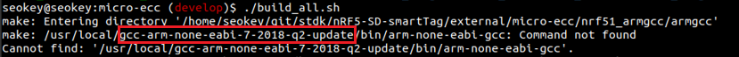
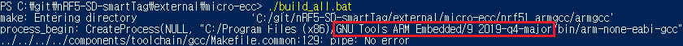
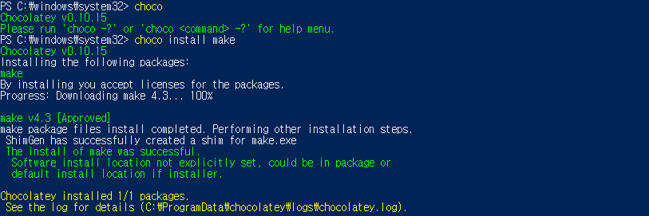
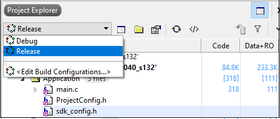
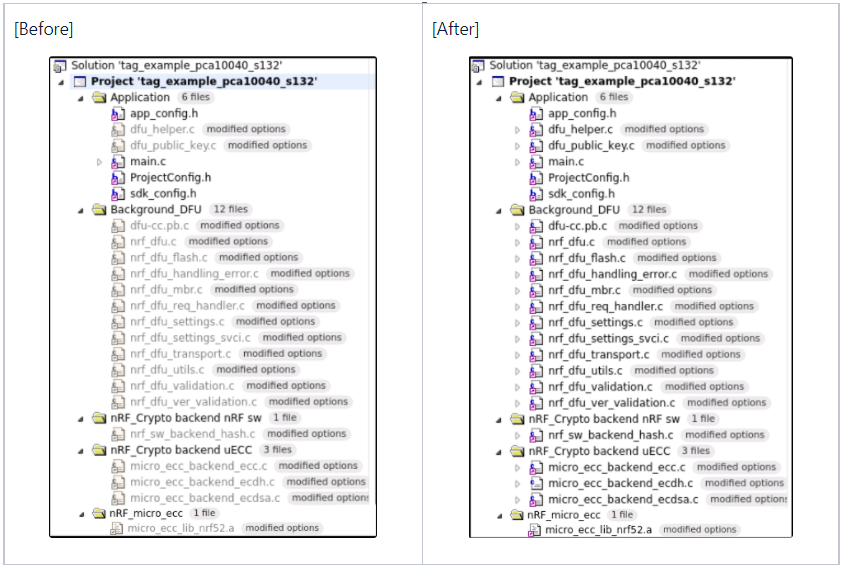
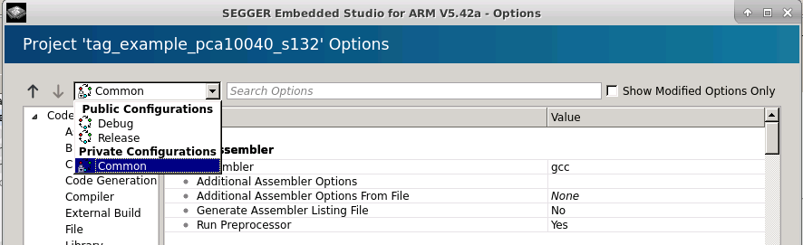

# Firmware Update Guide for nRF52

The nRF52 solution provides a DFU(Device Firmware Update) function downloading a device firmware at Bootloader mode and Background DFU updating the firmware from the application context. This guide is about the Background DFU. When the firmware built based on the below guide is uploaded at Developer workspace, it will be downloaded on the the device by the application protocol between the SmartThings App and the device application. And it will be installed at the device based on the Background DFU.

And this guide is applicable to **nRF52832 or nRF52833** chip only. So if you want to use other chipsets, Please contact a technical support channel.

This document contains
* [Build a project for the Background DFU](./How_to_create_firmware_for_nRF52_dk.md#1-Build-Background-DFU-project)
* [Download and update the firmware](./How_to_create_firmware_for_nRF52_dk.md#2-Download-and-update-the-firmware)

***


## 1. Build Background DFU project

### 1.1 Build a tag bootloader

(1) Open a secure bootloader project.
- nRF52832
```sh
./examples/dfu/secure_bootloader/pca10040_s113_ble/ses/secure_bootloader_ble_s113_pca10040.emProject
``` 
If secure bootloader is not exist in SDK, please copy bootloader into SDK.
```sh
unzip ./external/TagSDK/example/nrf/background_DFU/patch/secure_bootloader_pca10040_s113_ble.zip
mv ./external/TagSDK/example/nrf/background_DFU/patch/pca10040_s113_ble ./examples/dfu/secure_bootloader/
``` 
- nRF52833
```sh
./examples/dfu/secure_bootloader/pca10100_s113_ble/ses/secure_bootloader_ble_s113_pca10100.emProject
```

(2) Apply patch for Background DFU.

```sh
cp ./external/TagSDK/example/nrf/background_DFU/patch/nrf_dfu_utils.c ./components/libraries/bootloader/dfu/nrf_dfu_utils.c
cp ./external/TagSDK/example/nrf/background_DFU/patch/nrf_dfu_flash.c ./components/libraries/bootloader/dfu/nrf_dfu_flash.c
cp ./external/TagSDK/example/nrf/background_DFU/patch/dfu_public_key.c ./examples/dfu/dfu_Public_key.c
```

(3) Change the compile options.

`./examples/dfu/secure_bootloader/pcaXXXXX_sXXX_ble/config/sdk_config.h`

```c
#define NRF_BL_DFU_ALLOW_UPDATE_FROM_APP 1
#define NRF_DFU_FORCE_DUAL_BANK_APP_UPDATES 1
#define NRF_DFU_REQUIRE_SIGNED_APP_UPDATE 1
#define NRF_CRYPTO_BACKEND_MICRO_ECC_ECC_SECP256R1_ENABLED 1
#define NRF_CRYPTO_BACKEND_OBERON_ECC_SECP256R1_ENABLED 0
#define NRF_CRYPTO_BACKEND_OBERON_HASH_SHA256_ENABLED 0
```

(4) Build micro-ecc library for the firmware verification

Under Linux :
- Check GCC Compiler version to build micro-ecc library


- Download [GCC Compiler](https://developer.arm.com/tools-and-software/open-source-software/developer-tools/gnu-toolchain/gnu-rm/downloads)  and install it

```sh
cd ./external/micro-ecc
./build_all.sh
```

Under Windows :
- Check GCC Compiler version to build micro-ecc library


- Download [GCC Compiler](https://developer.arm.com/tools-and-software/open-source-software/developer-tools/gnu-toolchain/gnu-rm/downloads)  and install it

- Install the [Chocolatey](https://chocolatey.org/) (Software Management Automation) 
- Install the make package under chocolatey tool (run the command prompt terminal as administrator right)


- Build micro-ecc library

```sh
cd ./external/micro-ecc
./build_all.sh
```

(5) Build project.


### 1.2 Build a tag application Project

(1) Open a tag application project and change build configuration

The binary size of debug image is very large than the release image. So i suggest to use release image for background DFU.



(2) Change the compile options for the firmware signing.

`./external/TagSDK/example/nrf/pcaXXXXX/sXXX/config/sdk_config.h`

```c
#define NRF_CRYPTO_BACKEND_MICRO_ECC_ENABLED 1
```

(3) Change the compile options.

`./external/TagSDK/example/nrf/app_config.h`

```c
#define NRF_DFU_IN_APP 1
```

(4) please enable below files by using 'Exclude from build' option in project.

`Project > Options > Build > Exclude From Build`



(5) Change memory segments in project. 

`Project > Options > select Common`



`Project > Options > Code > linker > memory segments`

```sh
FLASH RX 0x0 0x80000;RAM1 RWX 0x20000000 0x10000;mbr_params_page RX 0x0007E000 0x1000;bootloader_settings_page RX 0x0007F000 0x1000;uicr_mbr_params_page RX 0x10001018 0x4;uicr_bootloader_start_address RX 0x10001014 0x4
```

(6) Edit memory section placement and add 4 memory sections.

`./external/TagSDK/example/nrf/pcaXXXXX/sXXX/ses/flash_placement.xml`

```sh
<MemorySegment name="mbr_params_page" start="0x0007E000" size="0x1000">
<ProgramSection alignment="4" keep="Yes" load="No" name=".mbr_params_page" address_symbol="__start_mbr_params_page" end_symbol="__stop_mbr_params_page" start = "0x0007E000" size="0x1000" />
</MemorySegment>
<MemorySegment name="bootloader_settings_page" start="0x0007F000" size="0x1000">
<ProgramSection alignment="4" keep="Yes" load="No" name=".bootloader_settings_page" address_symbol="__start_bootloader_settings_page" end_symbol="__stop_bootloader_settings_page" start = "0x0007F000" size="0x1000" />
</MemorySegment>
<MemorySegment name="uicr_mbr_params_page" start="0x10001018" size="0x4">
<ProgramSection alignment="4" keep="Yes" load="Yes" name=".uicr_mbr_params_page" address_symbol="__start_uicr_mbr_params_page" end_symbol="__stop_uicr_mbr_params_page" start = "0x10001018" size="0x4" />
</MemorySegment>
<MemorySegment name="uicr_bootloader_start_address" start="0x10001014" size="0x4">
<ProgramSection alignment="4" keep="Yes" load="Yes" name=".uicr_bootloader_start_address" address_symbol="__start_uicr_bootloader_start_address" end_symbol="__stop_uicr_bootloader_start_address" start = "0x10001014" size="0x4" />
</MemorySegment>
```

(7) Build project.


## 2. Download and update the firmware
-------------------------------
You can flash the firmware to your device by SmartThings App. For your product, it should be updated by uploading the firmware to Developer workspace.

### **2.1 Flash a firmware to the device**

(1) Prerequisites 

- Download [nrfutil tool](https://github.com/NordicSemiconductor/pc-nrfutil/releases)  (Example: if you copy nrfutil tool in C:\nrfutil then you have to add it to the Windows PATH environment variable)

- Install crc python package

```sh
pip install crc==1.2.0
```

(2) Run below script to write the binary to the flash memory in the device. (Input: bootloader, application, soft Device)

`./external/TagSDK/tools/scripts/prog_sd_app_bl.py` 
```sh
PS C:\git\nRF5-SD-smartTag\external\TagSDK\tools\scripts> python .\prog_sd_app_bl.py
------------------------------
1 : nRF52832_pca10040_s132
2 : nRF52833_pca10100_s113
------------------------------
Input your IC part number idx: 2
device snr       : 685303330

target board     : pca10100
target IC        : nrf52833
Softdevice ver.  : s113_nrf52_7.2.0_softdevice.hex

Start...
Generate bootloader settings...
(done)
Merge bootloader and settings...
(done)
Erase...
(done)
Program softdevice...
(done)
Program merged bootloader file...
(done)
Program application file...
(done)
Reset...
(done)
Bye :-)
```

### **2.2 Create firmware signed and upload a firmware in SmartThings Developer Workspace**
You can refer to how to upload a firmware to Developer Workspace. The firmware uploaded at Developer Workspace must be signed. It can be signed by the below script `create_firmware.py`.

(1) Run below script to create a new private key and public key for firmware signing.
```sh
pip install nrfutil
nrfutil keys generate private_key.pem
nrfutil keys display --key pk --format code private_key.pem --out_file dfu_Public_key.c
cp dfu_Public_key.c ./nRF5-SD-smartTag/example/dfu/dfu_Public_key.c
cp private_key.pem ./nRF5-SD-smartTag/external/TagSDK/tools/scripts/in_files/private_key.pem
```
(2) Run below script to create the firmware signed 

```sh
PS C:\git\nRF5-SD-smartTag\external\TagSDK\tools\scripts> python3 .\create_firmware.py
------------------------------
1 : nRF52832_pca10040_s132
2 : nRF52833_pca10100_s113
------------------------------
Input your IC part number idx: 2
(done)
New firmware is generated: C:\git\nRF5-SD-smartTag\external\TagSDK\tools\scripts\out_files\firmware.bin
```


(3) Upload the new firmware 'firmware.bin' in OTA server(SmartThings Developer workspace).
* [Firmware Update Test Method](./Firmware_update_guide.md#3-Firmware-Update-Test-Method)

please use 'firmware.bin' file to test OTA feature.


