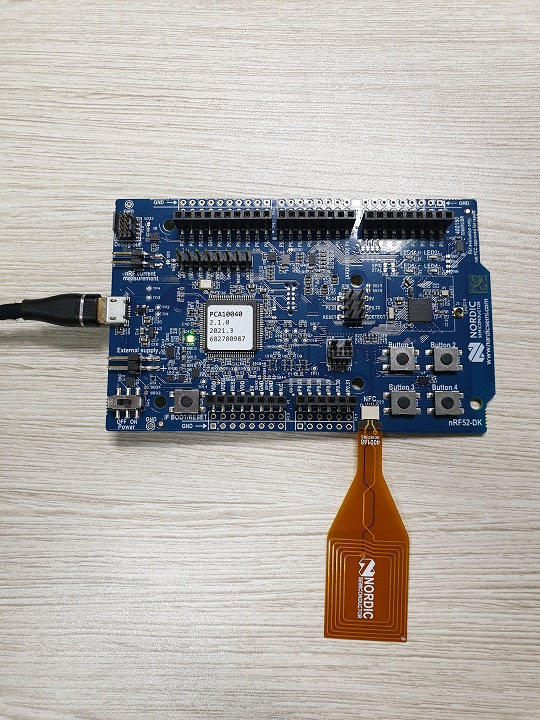
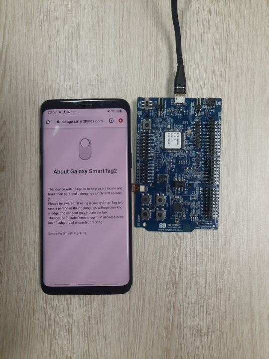

# How to test NFC functionality for nRF52 DK

1. [Build and run the project](#1-Build-and-run-the-project)
2. [Check NFC field using smartphone](#2-Check-NFC-field-using-smartphone)

## Prerequisite

This document explains on how to test NFC functionality using example project that available on TagSDK. For more information about how to setup the SDK and the steps required to run the example project, please refer to [Getting Started Page](./Getting_started_Nordic.md)

## 1) Build and run the project

Using the example project than can be accessed at [Getting Started](./Getting_started_Nordic.md), we can enable NFC functionality by doing following steps:

1. Open Segger studio and open the SDK nRF example solution (`external/TagSDK/example/nrf/pca10040/s113/ses/tag_example_pca10040_s113.emProject`).

2. Open `TagAccessoryOption.h` under `external/TagSDK/conf/` and change `TAG_ACCESSORY_OPTION_LOST_MESSAGE` value to 1.
    ```h
    /**
    * The SDK support to set lost message URL to NFC
    *
    * \note You can enable or disable the feature by this config
    *
    */
    #define TAG_ACCESSORY_OPTION_LOST_MESSAGE (1)
    ```

3. Open `sdk_config.h` under `external/TagSDK/example/nrf/pca10040/s113/config` and change these items' value to 1.
    ```h
    #define NRFX_NFCT_ENABLED 1
    #define TIMER4_ENABLED 1
    #define NFC_NDEF_MSG_ENABLED 1
    #define NFC_NDEF_RECORD_ENABLED 1
    #define NFC_NDEF_URI_MSG_ENABLED 1
    #define NFC_NDEF_URI_REC_ENABLED 1
    #define NFC_PLATFORM_ENABLED 1
    #define NFC_T2T_PARSER_ENABLED 1
    ```

4. Search for NFC connector in the board and connect the NFC antenna. 
    

5. Connect nRF52 DK board to your PC by using micro USB cable. And click `build and Run` from `build` menu.

6. Please check serial logs if it's working well.
   - click `Connect J-link` and `Attach debugger` to do RTT logging from `Target` menu.
   - And click `Debug terminal` from `View` menu.


## 2) Check NFC field using smartphone

After successfully [build and run the example project](#1-Build-and-run-the-project), we can check the NFC field by using NFC enabled smartphone.

1. Enable NFC on smartphone's settings.

2. Place the phone near the NFC antenna (The NFC area on your phone need to be in very close proximity with the antenna).


3. A link will be opened in the phone default browser (Default link is: https://lostmessage.smartthings.com?c=t).
