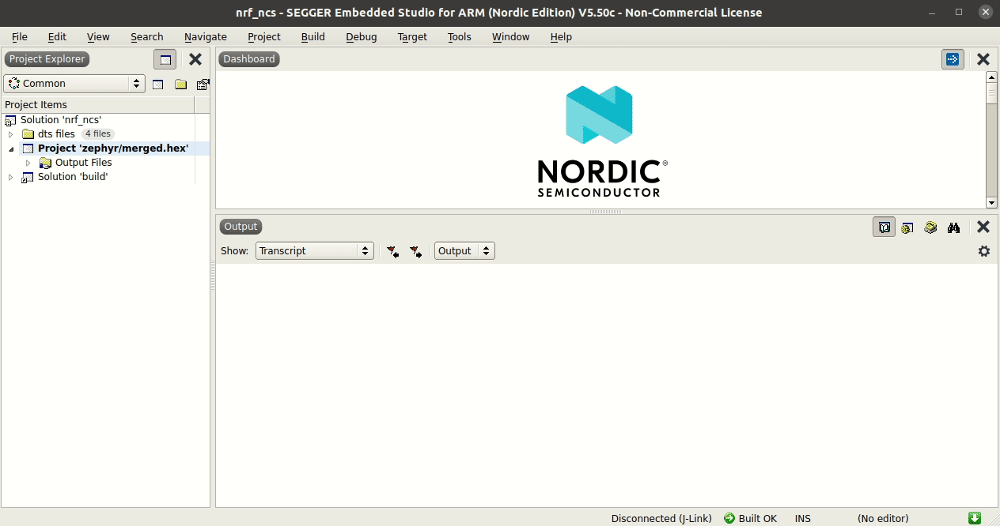
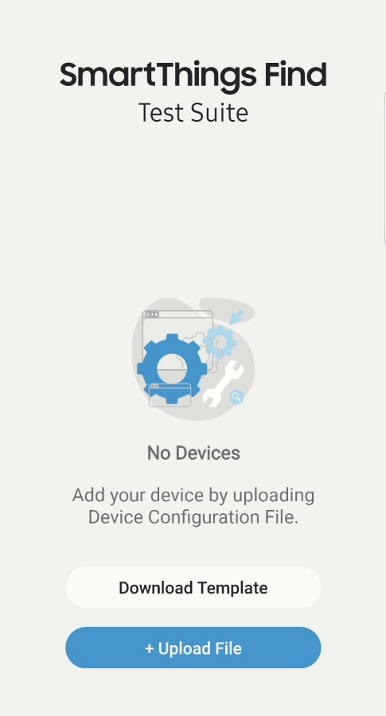

# How to test device with test suite app

1. [Download & Install](#1-Download-&-Install)
2. [Get csv file](#2-Get-csv-file)
2. [Upload test csv file to Test Suite APP](#3-Upload-test-csv-file-to-Test-Suite-APP)

## 1. Download & Install

To get the install package of test suite APP, please check the [TestSuite](../../../../TestSuite) folder in partnership git.

## 2. Get csv file

After getting the correct `TagDeviceInfo.h` and `TagOnboardingConfig.h` files by [How_to_register_device guide](../../../../TechSupport/wiki/How-to-register-device), a python script can be used to help user to easily create .csv file which describes the necessary information of tested device for test suite APP.

### 2.1 Manually 

```sh
cd ~/TagSDK/tools/create_test_csv/
python create_test_csv.py
```

 If all steps are correct, a csv file with the name includes last 4 characters of SN will be created like below.


### 2.2 Automatically 

#### nRF Series

The script can be integrated into SEGGER Embedded Studio by the following setting:

- Open the `options...` of `Project 'zephyr/merged.hex'`.
- select `User Build Step`.
- Add `python ../../../../tools/create_test_csv/create_test_csv.py` to `Post-build command` option.
- Select `Always Run` for `Post-build command control` option.
-  Click `Build -> Build Solution ` and the csv file will be created in the SES build folder (e.g TagSDK/example/nrf_ncs/build_nrf52840dk_nrf52840).




## 3. Upload test csv file to Test Suite APP

- Copy the created .csv file to phone
- Start `Test Suite APP`
- Click `Upload File`
- Select the created .csv file, and then start the tests.


