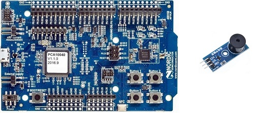
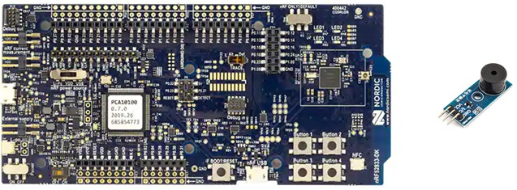
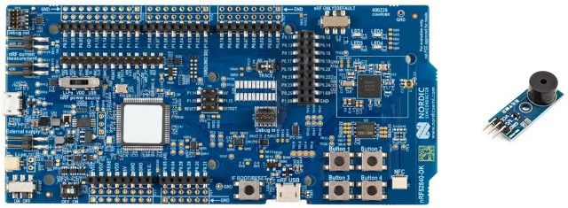
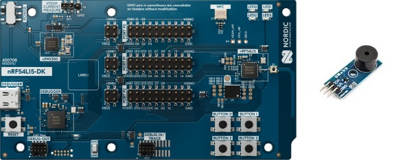
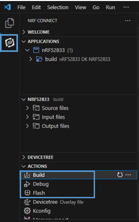
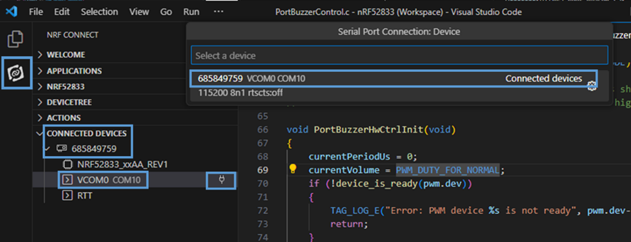

## Develop a device app

Now let's build and test examples. We prepare below examples for your test. Choose right one with your chipset.

### nRF5 SDK 17.0.2

1. Please prepare the following prerequisites to build the nRF52 DK example.

    - a [nRF52832 DK](https://www.nordicsemi.com/Products/Development-hardware/nRF52-DK) board and passive sound buzzer(VCC, GND, I/O)  
    
    - a [nRF52833 DK](https://www.nordicsemi.com/Products/Development-hardware/nRF52833-DK) board and passive sound buzzer(VCC, GND, I/O)  
    
    - a [nRF52840 DK](https://www.nordicsemi.com/Products/Development-hardware/nRF52840-DK) board and passive sound buzzer(VCC, GND, I/O)  
        
    - Install [SEGGER Embedded Studio (V5.42a)](https://www.segger.com/downloads/embedded-studio/)
    - Download [17.0.2 nRF5 SDK with SoftDevice S113](https://www.nordicsemi.com/Products/Development-software/nRF5-SDK/Download) (In download website, please select 17.0.2 nRF5 SDK and SoftDevice S113 combination) for nRF52832 and nRF52833 DK. please use [SoftDevice s140](https://www.nordicsemi.com/Products/Development-software/nRF5-SDK/Download) for nRF52840 DK.

2. Copy this SDK to nRF SDK `external/TagSDK`. And from now regard file path base on nRF SDK root directory.

3. Copy prepared `TagDeviceInfo.h` and a `TagOnboardingConfig.h` files on above [section](#1-Download-SDK-Register-a-device) under `external/TagSDK/conf/`.

4. [Optional] To enable `NFC` features, refer to the [How to test NFC functionality for nRF52](./How_to_test_NFC_functionality_for_nRF52_DK.md) page.

5. Open Segger studio and open the SDK nRF example solution (`external/TagSDK/example/nrf/pca10040/s113/ses/tag_example_pca10040_s113.emProject`).

6. Connect sound buzzer to nRF52 DK board by:
   - Connect buzzer GND pin to GND pin on the board.
   - Connect buzzer I/O pin to P0.12 pin on the board.
   - Connect buzzer VCC pin to VDD pin on the board.

7. Connect nRF52 DK board to your PC. And click `build and Run` from `build` menu.

8. Please check serial logs if it's working well.
   - click `Connect J-link` and `Attach debugger` to do RTT logging from `Target` menu.
   - And click `Debug terminal` from `View` menu.

### nRF Connect SDK v2.9.0

1. Please prepare the following prerequisites to build the example application.

   - a [nRF54L15 DK](https://www.nordicsemi.com/Products/Development-hardware/nRF54L15-DK) board and passive sound buzzer(VCC, GND, I/O) 
    
   - a [nRF52840 DK](https://www.nordicsemi.com/Products/Development-hardware/nRF52840-DK) board and passive sound buzzer(VCC, GND, I/O)  
       
   - Install Visual Studio Code [Visual Studio Code](https://code.visualstudio.com/)
   - Install nRF Connect for Desktop [nRF Connect for Desktop](https://www.nordicsemi.com/Products/Development-tools/nrf-connect-for-desktop)
   - nrf-command-line-tools [nrf-command-line-tools](https://www.nordicsemi.com/Products/Development-tools/nrf-command-line-tools/download)
   - please check guide to install nRF Connect SDK v2.9.0. [nrf-connect-sdk-install-guide](https://docs.nordicsemi.com/bundle/ncs-2.9.0/page/nrf/installation/install_ncs.html)

2. Copy prepared `TagDeviceInfo.h` and a `TagOnboardingConfig.h` files on above [section](#1-Download-SDK-Register-a-device) under `TagSDK/conf/`.

3. Open Visual Studio Code -> File -> Open workspace from file...

   Select the project file (`TagSDK\example\nrf_ncs\nRF5XXXX\nRF5XXXX.code-workspace`).

4. Create a build configuration.
   - Board target: `nrf54l15dk/nrf54l15/cpuapp` or `nrf52840dk/nrf52840`
   - Base configuration files: `prj.conf`

5. Connect sound buzzer to nRF52 DK board by:
   - Connect buzzer GND pin to GND pin on the board.
   - Connect buzzer I/O pin to `P1.12 (nRF54L15)` or `P0.12 pin(nRF52840)` on the board.
   - Connect buzzer VCC pin to VDD pin on the board.

6. Connect your Nordic board to your PC. 
7. click `build` to create firmware and click `flash` to download firmware.

    

7. Please check serial logs if it's working well.

